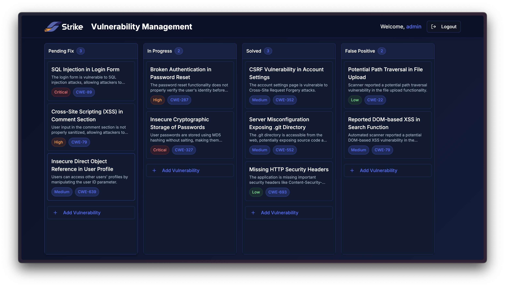

<br />
<div align="center">
  <a href="https://github.com/github_username/repo_name">
    
  </a>

</br>
<h1 align="center">Vuln Manager API</h1>

 
</div>

**Vuln Manager API** is a backend service designed to manage software vulnerabilities throughout their lifecycle. It provides a RESTful interface for creating, updating, and tracking vulnerabilities using a Jira-style workflow.

<details>
  <summary>Table of Contents</summary>
  <ol>
    <li><a href="#architecture">Architecture</a></li> 
    <li><a href="#tech-stack">Tech Stack</a></li> 
    <li><a href="#conventional-commits">Conventional Commits</a></li> 
    <li>
      <a href="#api-reference">API Reference</a>
      <ul>
        <li><a href="#authentication">Authentication</a></li>
        <li><a href="#get-all-vulnerabilities">Get All Vulnerabilities</a></li>
        <li><a href="#get-single-vulnerability">Get Single Vulnerability</a></li>
        <li><a href="#create-vulnerability">Create Vulnerability</a></li>
        <li><a href="#update-vulnerability">Update Vulnerability</a></li>
        <li><a href="#delete-vulnerability">Delete Vulnerability</a></li>
      </ul>
    </li>
    <li><a href="#server-demo">Server Demo</a></li>
    <li><a href="#client-demo">Client Demo</a></li>
  </ol>
</details>

## Architecture
The project follows a Clean Architecture approach combined with principles from Domain-Driven Design (DDD). This architecture separates the system into well-defined layers with a specific responsibility. It promotes modularity, testability, and long-term maintainability by isolating business logic from framework-specific code and defining boundaries between components.

```
vuln-manager/
│
├── src/
│   ├── vulns/                # Bounded context: Vulnerabilities
│   │   ├── application/
│   │   │   ├── usecases/     # Core business logic
│   │   │   └── repository/   # Repository interface 
│   │   ├── domain/
│   │   │   └── entities/     # Domain models
│   │   ├── infrastructure/
│   │   │   ├── entities/     # ORM entities (TypeORM)
│   │   │   ├── repository/   # Concrete implementation
│   │   │   ├── controllers/  # HTTP entrypoints
│   │   │   └── presenters/   # Formatters for HTTP responses
│   │   └── vulns.module.ts
│   ├── auth/                 # Bounded context: Authentication
│   │   ├── application/
│   │   │   ├── strategies/   # JWT strategies (PassportJS)
│   │   │   └── usecases/     # Authentication-specific logic
│   │   ├── infrastructure/
│   │   │   ├── controllers/  # Auth-related endpoints
│   │   │   └── guards/       # NestJS guards for protecting routes
│   │   └── auth.module.ts
│   ├── config/               # Global app configuration
│   ├── main.ts               # NestJS app entrypoint
│   └── app.module.ts         # Root application module
```
This structure brings several benefits:

- **Separation of Concerns**: The architecture clearly separates the domain, application, and infrastructure layers, allowing each to evolve independently and improving long-term maintainability.

- **Testability**: By isolating business rules from external concerns, the core logic can be unit tested in isolation, leading to faster, more reliable test feedback loops.

- **Flexibility**: Leveraging _Dependency Injection_ and _Inversion of Control_, the system decouples business logic from frameworks and infrastructure. This enables seamless replacement of components like databases, web servers, or authentication strategies without impacting core functionality.

- **Alignment with DDD**: The structure follows _Domain-Driven Design_ principles by organizing code around meaningful business concepts using _Entities_, _Repositories_, and a _Ubiquitous Language_, ensuring the domain model remains expressive and independent of technical details.

## Tech Stack

- **[NestJS](https://nestjs.com/):** A progressive Node.js framework for building efficient and scalable server-side applications.
- **[TypeORM](https://typeorm.io/):** An ORM that supports TypeScript and enables easy interaction with relational databases.
- **MySQL:** A reliable relational database used to store and manage vulnerability data.
- **[Passport.js](https://www.passportjs.org/):** Middleware for handling authentication, integrated with NestJS for JWT-based security.
- **[Railway](https://railway.app/):** A cloud platform used to deploy the API and manage the MySQL database in a streamlined DevOps workflow.

## Conventional Commits

This project follows the [Conventional Commits](https://www.conventionalcommits.org/) specification for commit messages. Using this convention helps:
- Clearly communicate the purpose of each change (e.g., `feat`, `fix`, `refactor`)
- Enable automated tools for changelog generation, versioning, and CI/CD workflows
- Improve collaboration and maintain a clean commit history

#### Example:  
> `feat(auth): add JWT login and token strategy`  
> `fix(vulns): correct status enum parsing in controller`

## API Reference

### Authentication

```http
POST /auth/login
```

| Parameter | Type     | Description                |
| :-------- | :------- | :------------------------- |
| `email` | `string` | **Required**. User email |
| `password` | `string` | **Required**. User password |

#### Response:
```typescript
{
  "user":
    {
      "username": string,
      "id": string,
      "email": string
    },
  "accessToken": string
}
```

---
### Get All Vulnerabilities
```http
GET /api/vulns
```

#### Response:
```typescript
[
  {
    id: string,
    createdAt: Date,
    updatedAt: Date,
    title: string,
    description: string,
    severity: string,
    status: string,
    cweId: string,
    suggestedFix: string,
    userId: string,
  }
]
```

---
### Get Single Vulnerability
```http
GET /api/vulns/${id}
```

| Parameter | Type     | Description                       |
| :-------- | :------- | :-------------------------------- |
| `id`      | `string` | **Required**. Id of vulnerability to fetch |

#### Response:
```typescript
{
  id: string,
  createdAt: Date,
  updatedAt: Date,
  title: string,
  description: string,
  severity: string,
  status: string,
  cweId: string,
  suggestedFix: string,
  userId: string,
}
```

---
### Create Vulnerability

```http
POST /api/vulns
```

| Parameter | Type     | Description                       |
| :-------- | :------- | :-------------------------------- |
| `title` | `string` | **Required**. Title (3-100 chars) |
| `description` | `string` | **Required**. Description (min 10 chars) |
| `severity` | `enum` | **Required**. Vulnerability severity |
| `cweId` | `string` | **Required**. CWE ID (numeric) |
| `suggestedFix` | `string` | **Required**. Suggested fix (min 10 chars) |

#### Response:
```typescript
{
  id: string,
  createdAt: Date,
}
```

### Update Vulnerability

```http
PUT /api/vulns/${id}
```

| Parameter | Type     | Description                       |
| :-------- | :------- | :-------------------------------- |
| `title` | `string` | **Optional**. Title (3-100 chars) |
| `description` | `string` | **Optional**. Description (min 10 chars) |
| `severity` | `enum` | **Optional**. Vulnerability severity |
| `status` | `enum` | **Optional**. Vulnerability status |
| `cweId` | `string` | **Optional**. CWE ID (numeric) |
| `suggestedFix` | `string` | **Optional**. Suggested fix (min 10 chars) |

#### Response:
```typescript
{
  id: string,
  updatedAt: Date,
}
```

---
### Update Vulnerability

```http
PUT /api/vulns/${id}
```

| Parameter | Type     | Description                       |
| :-------- | :------- | :-------------------------------- |
| `title` | `string` | **Optional**. Title (3-100 chars) |
| `description` | `string` | **Optional**. Description (min 10 chars) |
| `severity` | `enum` | **Optional**. Vulnerability severity |
| `status` | `enum` | **Optional**. Vulnerability status |
| `cweId` | `string` | **Optional**. CWE ID (numeric) |
| `suggestedFix` | `string` | **Optional**. Suggested fix (min 10 chars) |

#### Response:
```typescript
{
  id: string,
  updatedAt: Date,
}
```

---
### Delete Vulnerability

```http
DELETE /api/vulns/${id}
```

| Parameter | Type     | Description                       |
| :-------- | :------- | :-------------------------------- |
| `id` | `string` | **Required**. Id of vulnerability to delete |

#### Response: 
`Status 204`

## Server Demo

A live version of the API is deployed on Railway and accessible at the following URL:

🔗 **[https://vul-manager.up.railway.app](https://vul-manager.up.railway.app)**

You can use this url to interact with the service and test features like vulnerability creation, listing, and status updates.

```bash
curl -X POST https://vul-manager.up.railway.app/api/vulns \
  -H "Content-Type: application/json" \
  -H "Authorization: Bearer <your-jwt-token>" \
  -d '{
    "title": "Example SQL Injection",
    "description": "Demo vulnerability description.",
    "severity": "HIGH",
    "status": "PENDING_FIX",
    "cweId": "89",
    "suggestedFix": "Use prepared statements."
  }'
```

## Client Demo

A companion frontend application built with **Next.js** is available to interact with this API.

> 🙏🏻 Note: The frontend was built primarily for **demonstration purposes**. While functional, it may not reflect production-level frontend practices, as frontend development **is not** my primary area of expertise.

🔗 **Live App:** [https://vul-manager-frontend.up.railway.app](https://vul-manager-frontend.up.railway.app)  
📁 **Source Code:** [github.com/lmitelman/vul-manager-frontend](https://github.com/lmitelman/vul-manager-frontend)



This UI provides a basic interface to authenticate and manage vulnerabilities through the API.


